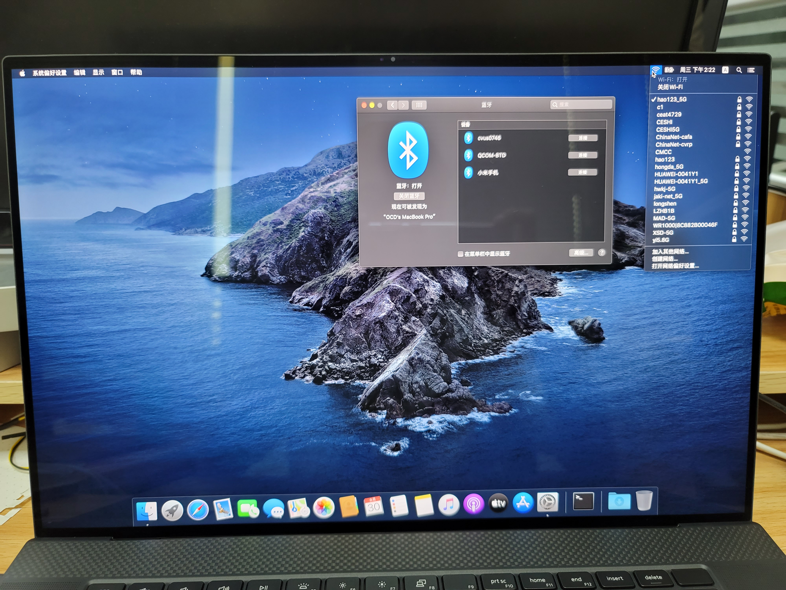

# 由于扬声器无法解决问题, 短期内将不会更新

# Dell XPS 9700 macOS X

这是使用 OpenCore 制作的 EFI, 可以在 Dell XPS 17 9700(2020) 上安装 macOS X Catalina.

<b>OpenCore Version:</b> 0.6.2

<b>macOS Version:</b> Catalina 10.15.7



---

## 功能状态

|功能 / 硬件|状态|
|-|-|
|核显 UHD630 |已驱动|
|CPU 电源管理|正常工作 - 空闲800MHz, 最高至睿频|
|内置键盘|已驱动|
|内置触摸板/触摸板手势|已驱动/正常|
|耳机孔|未驱动|
|声卡|未驱动|
|麦克风|未驱动|
|声音快捷键(FN键)|正常工作|
|USB 3.x|Working|
|USB 2.0|Working|
|指纹识别模块|未驱动|
|SD卡插槽|未驱动|
|屏幕亮度|正常驱动可以调节亮度(快捷键未映射)|
|wifi模块(AX1650S)|已驱动|
|蓝牙|已驱动|
|外接扩展坞的网卡|貌似全部无法使用(我自己是这样)|
|扩展坞上其他功能(除网卡)|正常|
|内置摄像头|已驱动|
|睡眠|dell xps 17 9700 无法开启 s3 睡眠, 目前无法睡眠|

---

## BIOS 设置

关闭以下选项
 - Touchscreen (如果有触摸屏的话必须关闭, 否则触摸板无法使用)
 - Secure boot
 - Disable CFG Lock (via modGRUBShell)

---

## 重要

Dell XPS 17 9700 部分机型配的固态为海力士 PC611 无法在 macOS 上驱动且不屏蔽会无法进入系统/安装界面, 可在bios内屏蔽

---

## 关闭 CFG LOCK

此方法仅适用于 Dell XPS 17 9700

启动时在 OpenCore 引导页选择 modGRUBShell
在 grub 下输入以下命令, 第一行解锁 CFG LOCK, 第二行解锁超频

```
setup_var CpuSetup 0x3e 0x0
setup_var CpuSetup 0xda 0x0
exit
```

重启进入 bios 选择重新加载用户配置. 可以在 VerifyMSR2 检查 CFG LOCK 是否已解锁

如果更新/刷 bios 后需要重复上面的步骤

---

## 关于睡眠的问题

进入系统后执行: sudo pmset -a disablesleep 1

---

## 声卡/耳机孔

目前正在尝试处理, 有进展会更新